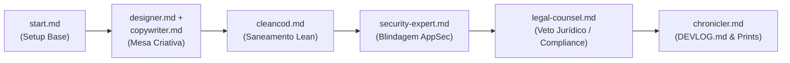

# Catalogo de Agentes Reutilizaveis

Este repositório reúne especificações de agentes inteligentes em formato Markdown (`.md`) para inicialização, design, redação, engenharia limpa, segurança, compliance jurídico e documentação contínua de projetos em múltiplos ecossistemas.

---

## Agentes Disponíveis

| Agente | Arquivo | Responsabilidade Principal | Agentes Relacionados |
| :--- | :--- | :--- | :--- |
| **Start Agent** | [`start.md`](./start.md) | **Orquestrador Geral:** Inicialização completa de projetos Next.js (App Router), arquitetura multi-tenant, design system dos projetos **Qualidade & Bahia** (Outfit/Inter, ambient mesh, glassmorphism), criação de repositório no GitHub e **acionamento automático de todos os demais agentes em esteira contínua**. | Todos os agentes da esteira |
| **Designer (UI/UX)** | [`designer.md`](./designer.md) | O artista visual e maestro de UI/UX: estética de alto impacto, domínio e genialidade (estilo Qualidade & Bahia, Dual Theme, glassmorphism de precisão), biblioteca de referências e **responsividade absoluta de 360px a 4K (zero scroll horizontal e touch targets 44px+)**. | `copywriter`, `start`, `chronicler` |
| **Copywriter & UX Writer** | [`copywriter.md`](./copywriter.md) | Especialista em redação de interfaces, escaneabilidade, microcopy enxuto, eliminação de acúmulo de textos e consenso obrigatório com o `designer` para validação de cards e telas. | `designer`, `cleancod` |
| **Clean Code & Lean** | [`cleancod.md`](./cleancod.md) | Especialista sênior em boas práticas, código limpo, eliminação de desperdício (Lean), proibição total de emojis nos sistemas, modularidade extrema (máx 150 linhas/arquivo) e economia de tokens para agentes de IA. | `start`, `security-expert` |
| **Security Expert** | [`security-expert.md`](./security-expert.md) | Auditor sênior de AppSec para SaaS comercial e escalável: isolamento multi-tenant hermético (RLS), blindagem agnóstica de provedores de IA, cabeçalhos HTTP, prevenção de IDOR e zero emojis. | `start`, `cleancod`, `legal-counsel` |
| **Legal Counsel & Cyber Law** | [`legal-counsel.md`](./legal-counsel.md) | **Autoridade Jurídica com Poder de Veto Definitivo:** Auditoria de licenças no `package.json` (bloqueio de GPL/AGPL viral em SaaS fechado), compliance LGPD/GDPR, geração de Termos de Uso e Política de Privacidade. Paralisa a esteira se houver risco de litígio ou multa. | `security-expert`, `chronicler`, `cleancod` |
| **Dev Chronicler & Historian** | [`chronicler.md`](./chronicler.md) | O guardião da história do sistema, autor do diário de bordo (`DEVLOG.md`) e contador de horas: cataloga tudo o que a solução entrega, registra cada solicitação do usuário, organiza a galeria de prints/evidências, contabiliza e soma todas as horas trabalhadas e calcula a precificação do projeto. | Todos os agentes da esteira |

---

## Diretrizes Globais Obrigatórias

Todos os agentes deste catálogo devem seguir estas regras transversais:
1. **Zero Emojis nos Sistemas:** É terminantemente proibido o uso de emojis em interfaces de usuário, botões, modais, headers, cards, toasts, logs de console ou mensagens de commit. Utilizar exclusivamente ícones vetoriais da biblioteca `lucide-react` ou rótulos semânticos de texto.
2. **Economia de Tokens de IA:** Manter arquivos concisos (100 a 150 linhas), funções curtas (20 a 30 linhas) e tipos bem definidos para facilitar leituras rápidas e edições de outros agentes com custo mínimo de contexto.
3. **Identidade Visual High-Tech:** Adotar o padrão visual dos projetos Qualidade e Bahia (gradientes radiais sutis, glassmorphism com `.glow-card`, tipografia Outfit/Inter e suporte nativo a temas Claro e Escuro).
4. **Memória Viva & Rastreabilidade:** Toda alteração significativa e solicitação do usuário deve ser registrada no `DEVLOG.md` pelo `chronicler.md`, acompanhada de prints na pasta `docs/prints/`.
5. **Soberania do Veto Jurídico:** Nenhum código vai para produção se o `legal-counsel.md` emitir um veto por risco regulatório, de licença open-source viral ou violação da LGPD.

---

## Como Utilizar (Orquestração Total em Cadeia)

Você só precisa chamar o **`start.md`**. Ele assume o controle do projeto e aciona **todos os agentes em uma esteira ininterrupta**:

### O Fluxo Automático Passo a Passo:
1. **`start.md` (Passos 1 a 4):** Coleta as diretrizes do usuário, cria o projeto Next.js + Tailwind v4 + TypeScript e configura a governança multi-tenant.
2. **`designer.md` + `copywriter.md` (Passo 5):** Convocados em consenso para criar a atmosfera visual (cores, mesh, glassmorphism) e redigir microcopys sem prolixidade e sem emojis.
3. **`cleancod.md` (Passo 6):** Audita os arquivos criados, aplica modularidade estrita (máx 150 linhas), elimina dead code e otimiza para consumo mínimo de tokens de IA.
4. **Git e Repositório GitHub (Passo 7):** Criação do repositório remoto e commit inicial limpo.
5. **`security-expert.md` (Passo 8):** Audita o isolamento multi-tenant (RLS Supabase/PostgreSQL), configura headers HTTP de segurança e validação Zod.
6. **`legal-counsel.md` (Passo 9):** Audita licenças do `package.json`, valida conformidade com a LGPD e gera `docs/legal/TERMS_OF_SERVICE.md` e `PRIVACY_POLICY.md`. Exerce **veto definitivo** se houver irregularidades.
7. **`chronicler.md` (Passo 10):** Cria o `DEVLOG.md`, arquiva os prints das telas em `docs/prints/`, documenta a Entrada #001 com a história completa e entrega o Resumo Executivo das capacidades prontas diretamente no chat para o usuário.
